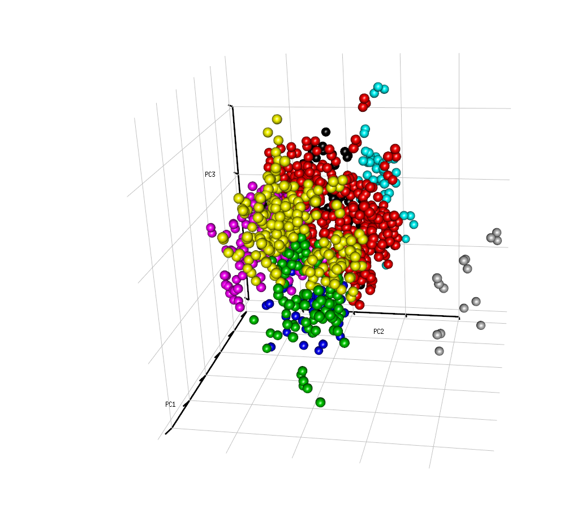

```{r packages, echo=FALSE, message = FALSE, warning=FALSE}
if(!require("randomForest")) install.packages("randomForest")
if(!require("ggplot2")) install.packages("ggplot2")
if(!require("readxl")) install.packages("readxl")
if(!require("vegan")) install.packages("vegan")
if(!require("dplyr")) install.packages("dplyr")
if(!require("grid")) install.packages("grid")
if(!require("rgl")) install.packages("rgl")
if(!require("car")) install.packages("car")
```
## О проекте

Датасет содержит информацию о 77 белках, уровень экспрессии которых был измерен для мышей в коре мозга в норме и при синдроме дауна. всего в эксперименте участвовало 72 мыши, среди которых 38 контрольных мышей и 34 трисомических мыши (синдром Дауна). Для каждой мыши каждый белок измерялся 15 раз. Таким образом, данные содержат в общей сложности 1080 измерений на белок. Каждое измерение рассматривалось как независимый образец.

При этом все мыши были разделены на 8 классов:

* Генотип: контроль (c) или трисомия (t)
+ Поведение: стимулировались (C/S) или не стимулировались (S/C) к обучению
+ Лечение: препарат мемантин (m) или препарат салин (s)


**Задачи проекта**:

1. Сделать описание датасета
2. Определить, есть ли различия в уровне продукции BDNF_N в зависимости от класса в эксперименте
3. Построить линейную модель, способную предсказать уровень продукции белка ERBB4_N на основании данных о других белках в эксперименте
4. Провести анализ главных компонент (PCA)
5. Произвести поиск дифференциальных белков

## Начало работы

Перед началом работы подключим все необходимые библиотеки:

```{r libs, echo=TRUE}
library(randomForest)
library(ggplot2)
library(readxl)
library(vegan)
library(dplyr)
library(grid)
library(car)
library(rgl)
```

Посмотрим на структуру датасета:

```{r data_load, echo=FALSE}
path = 'data/Data_Cortex_Nuclear.xls'
data <- read_excel(path)
str(data)
```

Изучая структуру данных, устанавливаем, что каждому белку соответствует отдельная колонка, где в численном виде представлен уровень его экспрессии, также отдельно указаны все признаки мыши - Genotype, Treatment и Behavior. Наконец, отдельно указан класс мыши как комбинация трех этих признаков. 

У каждой мыши есть уникальный ID, он прописан в отдельной колонке MouseID, с пометкой о каждом новом измерении уровня экспрессии (по 15 для каждой мыши)

## Описание датасета

### Определение групп наблюдений

Определим, сбалансированны ли наблюдения по классам мышей, и какова структура распределения измерений:

```{r classes, echo=FALSE, fig.height = 8, fig.width = 9, fig.align = "center"}
ggplot(data, aes(class)) +
  geom_bar(aes(fill = class), alpha = 0.8) +
  theme_bw() +
  labs(title = "Количество измерений для каждого класса") + labs(x = "Класс", y = "количество наблюдений", fill = "Класс") + scale_fill_brewer(palette="RdYlGn")
```

Все классы:

   * c-CS-s: контрольная мышь, стимулировалась к обучению, лечение салином (9 штук)
   + c-CS-m: контрольная мышь, не стимулировалась к обучению, лечение мемантином (10 штук)
   + c-SC-s: контрольная мышь, не стимулировалась к обучению, лечение салином (9 штук)
   + c-SC-m: контрольная мышь, не стимулировалась к обучению,лечение мемантином (10 штук)
   + t-CS-s: мышь с трисомией, стимулировалась к обучению, лечение салином (7 штук)
   + t-CS-m: мышь с трисомией, стимулировалась к обучению, лечение мемантином (9 штук)
   + t-SC-s: мышь с трисомией, не стимулировалась к обучению, лечение салином (9 штук)
   + t-SC-m: мышь с трисомией, не стимулировалась к обучению, лечение мемантином (9 штук)
   
Исходя из полученного графика, видно, что наблюдения по классам распределены более менее равномерно.

### Поиск пропущенных значений

Определим, сколько пропущенных значений содержат данные:

```{r nas, echo=FALSE, fig.height = 8, fig.width = 10, fig.align = "center"}
hist(colSums(is.na(data)), breaks=seq(0,300, 5), 
     xlab = "количество отсутствующих значений", ylab = "количество колонок", col="darkorange", main = "Гистограмма распределения NA")
```

### Очистка данных

Большая часть данных не содержит пропущенных значений, однако, отдельные колонки имеют более 150 пропусков, что составляет ощутимый процент от 1080 значений (около 15%). Найдем эти колонки:


```{r bad prot, echo=TRUE}
cat(names(data)[colSums(is.na(data))>150])
```
Получили белки, для которых пропущенных значений оказалось больше 150. Такое большое число пропущенных значений будет некорректно заполнять вручную, поэтому эти белки были исключены из дальнейшего анализа.

```{r good prot, echo=TRUE, message=FALSE, warning=FALSE}
prots  <-  names(data)[0<=colSums(is.na(data))&colSums(is.na(data))<150]
prots <- prots[!prots %in% c("Genotype", "Treatment", "Behavior", "class", "MouseID")]
prots
```
Эти белки содержат некоторое количество пропущенных значений, которые будут заменены на медианные.
Также, следует привести в порядок типы некоторых колонок, в частности, сделать категориальные значения факторами:


```{r factors}
data$Genotype <- as.factor(data$Genotype)
data$Treatment <- as.factor(data$Treatment)
data$Behavior <- as.factor(data$Behavior)
data$class <- as.factor(data$class)

for(i in 1:length(prots)){
  data[prots[i]][is.na(data[prots[i]])] <- median(unlist(data[prots[i]]), na.rm=TRUE)
}

```

## Исследование данных

### Поиск различий в уровне продукции BDNF_N в зависимости от класса в эксперименте

Визуализируем уровень продукции белка BDNF в зависимости от класса мышей:


```{r exp, echo=FALSE, message=FALSE, warning=FALSE, fig.height = 10, fig.width = 10, fig.align = "center"}
#proteins = names(data[, names(data) %in% c(" BDNF_N", "ERBB4_N ")])

#for(i in 1:length(prots)){
#  plot <- ggplot(data, aes(eval(parse(text = prots[i])))) +
#    geom_histogram(aes(fill=..count..), color = "black", alpha = 0.7) +
#    scale_fill_gradient("Count", low="blue", high="darkred") +
#    labs(title = sprintf('белок: \"%s\"', prots[i], fill = "Число наблюдений"),
#         x = "Уровень экспрессии белка",
#         y = "Количество наблюдений") +
#    theme_light()
#  print(plot)
#}

ggplot(data, aes(x = class, y = BDNF_N)) +
    geom_boxplot(aes(fill = class), alpha = 0.7) +
    stat_summary(fun.y=mean, colour="white", geom="point", size=2) +
    labs(title = " f", y = 'уровень экспрессии BDNF_N', x = "", fill = "Класс") + scale_fill_brewer(palette="RdYlGn") +
    theme_bw()

```
Для того, чтобы убедиться, что для белка BDNF существует хотя бы одно значимое отличие по продукции в зависимости от класса, произведем анализ вариации ANOVA. Поскольку классов у нас 8, необходимо сделать поправку уровня значимости.

```{r Bonf, echo=FALSE}
pi = 0.01
bonf <- pi / length(unique(data$class))*(length(unique(data$class))-1)/2
cat("Уровень значимости после поправки Бонферрони: ", bonf)

```

```{r ANOVA, fig.align = "center"}
 
Analysis <- aov(BDNF_N ~ class, data = data)
 summary(Analysis)
 
t_test <- pairwise.t.test(as.vector(unlist(data$BDNF_N)), data$class, p.adjust = "none")
t_test$p.value < bonf


```
Нулевая гипотеза для ANOVA гласила, что между исследуемыми классами нет значимых различий в продукции белка BDNF. Альтернативная гипотеза заключала, что среди исследуемых классов есть хотя бы два, которые значимо различаются. 

в столбце Pr(>F) представлена вероятность получить F-значение, равное или превышающее то значение, которое мы рассчитали по имеющимся выборочным данным (при условии, что нулевая гипотеза верна).

Видно, что эта вероятность очень мала, следовательно, мы отвергаем нулевую гипотезу. Исходя из парного t-теста, значимые различия есть между 16 парами классов мышей.

### Построение линейной модели, предсказывающей уровень продукции белка ERBB4_N на основании данных о других белках в эксперименте


```{r linmodel, , results = "hide"}
model <- lm(ERBB4_N ~ ., data=data[prots])
summary(model) # спрятана, потому что очень длинная
```

Adjusted R-squared:  0.8033
Полная модель объясняет большой процент изменчивости, однако, здесь присутствуют компоненты, вклад которых пренебрежительно мал, и в дальнейшем их можно будет отбросить.

#### Диагностика модели

Построим график отклонений остатков модели

```{r diag, echo=FALSE, fig.height = 5, fig.width = 8, fig.align = "center"}
mod_diag <- fortify(model)
ggplot(mod_diag, aes(x = 1:nrow(mod_diag), y = .cooksd)) +
    geom_bar(stat = 'identity') + theme_bw() + labs(x = "измерения", y="Стандартизованные остатки")
```


```{r diagn, echo=FALSE, fig.height = 8, fig.width = 8, fig.align = "center"}
qqPlot(model, labels = row.names(data[prots]), simulate = TRUE, main = 'График Q-Q', , id=FALSE)
```
Видно, что присутствуют выбросы

### Подбор наилучшей модели

После того, как мы проанализировали полную модель, мы можем попытаться найти лучший способ предсказать экспрессию гена ERBB4_N, используя наши предикторы. Один из способов создания хорошей модели - это пошаговый выбор, когда мы начинаем с нашей полной модели и идем в обратном направлении, повторно используя количество предикторов с самыми большими AIC:

```{r step, results = "hide"}
backw_mod <- step(model, direction = "backward")
```

Итоговая модель, которую подобрал step:

```{r sum}
summary(backw_mod)
```
Adjusted R-squared:  0.807

В итоговой модели осталось довольно много предикторов, и анализировать ее вручную неудобно.

### Проведение анализа главных компонент (PCA)

Для начала определим главные компоненты для наших данных.

```{r pca, fig.height = 10, fig.width = 10, fig.align = "center"}
data <- tibble(data)


data.pca <- rda(data[prots], 
                scale = TRUE)
```


Определим, сколько компонент нам стоит оставить для анализа. Собственные числа для каждой из компонент:

```{r eigens}
eigenvals(data.pca) 
```

И соответствующий график для собственных чисел:

```{r pcatools, echo=FALSE }
screeplot(data.pca, type = "lines", npcs = 72, xlab = "Главная компонента", ylab = "Объясненная дисперсия (%)", bstick = TRUE)
```

#### Определение процента изменчивости, объясненного каждой компонентой


```{r comp}
x <- prcomp(data[,prots], center=TRUE, scale.=TRUE)
summary(x)

```

Исходя из полученных результатов, видно, что первая главная компонента объясняет 27% дисперсии, вторая 16%, третья - 10% и так далее.

#### График факторных нагрузок

Построим график факторных нагрузок:


```{r fact plot, echo=FALSE, fig.height = 10, fig.width = 10, fig.align = "center"}
for_plot <- as.data.frame(scores(data.pca, display = "species", 
                                choices = c(1, 2, 3), scaling = "species"))

for_plot$hjust[for_plot$PC1 >= 0] <- -0.1
for_plot$hjust[for_plot$PC1 < 0] <- 1
for_plot$vjust[for_plot$PC2 >= 0] <- -0.1
for_plot$vjust[for_plot$PC2 < 0] <- 1
ar <- arrow(length = unit(0.25, "cm"))


ggplot(for_plot) + 
  geom_text(aes(x = PC1, y = PC2, label = rownames(for_plot)), 
            size = 3, vjust = for_plot$vjust, hjust = for_plot$hjust) + 
  geom_segment(aes(x = 0, y = 0, xend = PC1, yend = PC2), 
               colour = "darkorange", arrow = ar) + 
  coord_equal(xlim = c(-1.9, 1.9), ylim = c(-1.9, 1.9)) + theme_bw()


```

#### График ординации


```{r ord, echo=FALSE, fig.height = 10, fig.width = 10, fig.align = "center"}
df_scores <- data.frame(data[prots],
  scores(data.pca, display = "sites", choices = c(1, 2, 3), scaling = "sites"))

 ggplot(df_scores, aes(x = PC1, y = PC2)) + 
  geom_point(aes(label = rownames(data[prots]), color=data$class)) +
  coord_equal(xlim = c(-1.2, 1.2), ylim = c(-1.2, 1.2)) + theme_bw()
```

#### 3D Визуализация графика по трем главным компонентам


```{r pca3d, echo=FALSE, warning=FALSE}

pca <- prcomp(data[prots], scale=TRUE)
fit <- hclust(dist(pca$x[,1:3]), method="complete") # 1:3 -> based on 3 components
groups <- cutree(fit, k=5)

plotPCA <- function(x, nGroup) {
    n <- ncol(x) 
    if(!(n %in% c(2,3))) { # check if 2d or 3d
        stop("x must have either 2 or 3 columns")
    }

    fit <- hclust(dist(x), method="complete") # cluster
    groups <- cutree(fit, k=nGroup)

    if(n == 3) { # 3d plot
        plot3d(x, col=groups, type="s", size=1, axes=F)
        axes3d(edges=c("x--", "y--", "z"), lwd=3, axes.len=2, labels=FALSE)
        grid3d("x")
        grid3d("y")
        grid3d("z")
    } else { # 2d plot
        maxes <- apply(abs(x), 2, max)
        rangeX <- c(-maxes[1], maxes[1])
        rangeY <- c(-maxes[2], maxes[2])
        plot(x, col=groups, pch=19, xlab=colnames(x)[1], ylab=colnames(x)[2], xlim=rangeX, ylim=rangeY)
        lines(c(0,0), rangeX*2)
        lines(rangeY*2, c(0,0))
    }
}

plotPCA(pca$x[,1:3], 8)

```
Полученный результат - скриншот графика, сам график интерактивен.


Рис.1. Визуализация графика PCA для трехмерного пространства

### Дополнительно: построим RandomForest модель для предсказания продукции ERBB4_N и сравним с линейной моделью

Перед созданием RF модели, разделим нашу выборку на ту, на которой будем обучать модель (тренировочную) и на ту, на которой будем проверять точность модели (тестовую):

```{r randfor}

samp_size <- floor(0.75 *nrow(data))
set.seed(43)
train_inds <- sample(seq_len(nrow(data)), size = samp_size)

train <- data[train_inds, prots]
test <- data[-train_inds, prots]

```

Задание параметров RandomForest модели:

```{r rf}
model <- randomForest(formula = ERBB4_N ~ DYRK1A_N + ITSN1_N + NR1_N + pAKT_N + 
    pBRAF_N + pCREB_N + pJNK_N + PKCA_N + pNR1_N + pNR2B_N + 
    pRSK_N + AKT_N + BRAF_N + CAMKII_N + ERK_N + RSK_N + SOD1_N + 
    MTOR_N + pMTOR_N + TIAM1_N + NUMB_N + P70S6_N + pGSK3B_N + 
    pPKCG_N + CDK5_N + AcetylH3K9_N + RRP1_N + ARC_N + Tau_N + 
    GFAP_N + GluR3_N + GluR4_N + IL1B_N + P3525_N + pCASP9_N + 
    PSD95_N + pGSK3B_Tyr216_N + pCFOS_N + SYP_N + CaNA_N,
             ntree=700,
             data=train,
             importance=TRUE)

model
y_pred = predict(model, test)

```

Задание параметров lm модели:

```{r lm_mod}


lin_model <- lm(formula = ERBB4_N ~ DYRK1A_N + ITSN1_N + NR1_N + pAKT_N + 
    pBRAF_N + pCREB_N + pJNK_N + PKCA_N + pNR1_N + pNR2B_N + 
    pRSK_N + AKT_N + BRAF_N + CAMKII_N + ERK_N + RSK_N + SOD1_N + 
    MTOR_N + pMTOR_N + TIAM1_N + NUMB_N + P70S6_N + pGSK3B_N + 
    pPKCG_N + CDK5_N + AcetylH3K9_N + RRP1_N + ARC_N + Tau_N + 
    GFAP_N + GluR3_N + GluR4_N + IL1B_N + P3525_N + pCASP9_N + 
    PSD95_N + pGSK3B_Tyr216_N + pCFOS_N + SYP_N + CaNA_N, data = train)

y_lin_pred = predict(lin_model, test)
```

```{r mae, echo=FALSE}
mae_for_rf <- mean(test$ERBB4_N - y_pred)
mae_for_lm <- mean(test$ERBB4_N - y_lin_pred)
cat("средняя абсолютная ошибка для RandomForest = ", mae_for_rf, ", для Lm = ", mae_for_lm)

```

По результатам сравнения двух моделей, одна из которых была получена ранее, видно, что RandomForest модель лучше предсказывает данные. Для модели RandomForest были взяты те же предикторы, что и для отобранной линейной модели.
